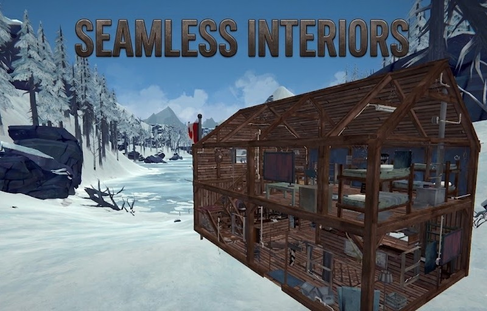

# The Long Dark - Seamless Interiors

> A massive overhaul mod developed for **The Long Dark** that aims to integrate all interior buildings directly into the open world without any loading screens. Walk through doors seamlessly and experience the interior and exterior as one unified environment.

*(Note: This project is in active development.*

### ⚠️ Disclaimer & Warning

> **⚠️ WARNING: EARLY DEVELOPMENT**
> This mod is in a very early stage of development. Even with testing, it may contain undiscovered bugs. **Do not use this with your primary/main save files.** Please consider the risks before installing. 
> 
> **Compatibility:** There is a high risk of conflict with other mods that modify the structure or interior of buildings. This has not been tested with other custom interior mods yet.

---

### ✨ Key Features

*   **Additive Scene Integration:** Directly loads and merges interior scenes into their respective exterior environments. This bypasses traditional loading screens, creating a strictly unified instance across the map.
*   **Dynamic Weather Culling:** Uses mathematically calculated interior bounds to deploy custom `ParticleKillerInstance` zones. This instantly culls outdoor snow and wind particles inside structures without relying on hard scene transitions.
*   **Real-Time Audio Occlusion:** Hooks into the game's `GameAudioManager` to dynamically apply `HeavyOcclusion` upon entering a building, ensuring realistic acoustic dampening of exterior weather and wildlife.
*   **Strict AI Pathfinding & Collision Boundaries:** Generates a precise, hollow `BoxCollider` perimeter combined with custom `NavMeshObstacle` components around interiors. This physically prevents wildlife from clipping through walls during high-velocity flee or scent-tracking behaviors.
*   **Deterministic Loot Synchronization:** Automatically handles spatial deduplication and PDID generation for gear items upon the first load, ensuring containers and originally spawned items transition flawlessly into the merged exterior space.

### ⚙️ Installation Guide

1.  Ensure you have **MelonLoader** installed on your PC.
2.  Download the latest version of the mod (`SeamlessInteriors.dll`) from the **Releases** section.
3.  Copy the `.dll` file into the `Mods` folder in your The Long Dark directory.
4.  Launch the game and enjoy your seamless world!

